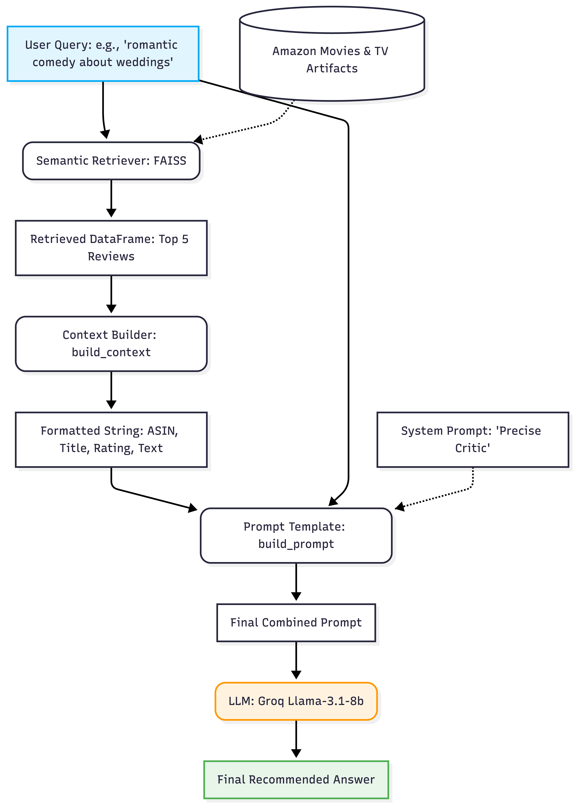

# DSCI_575_project_ji778_zhajy

# Movie & TV Retrieval System

## Project overview

This project builds a small retrieval system for the Amazon Movies and TV dataset. The goal is to let a user search product-related content using two retrieval methods:

-   BM25 search for keyword-based retrieval
-   Semantic search for embedding-based retrieval

A simple Streamlit web app is included so users can enter a query, choose a search mode, and view the top results.

For each result, the app displays: - product title - truncated review text - rating - retrieval score

## Environment setup

Clone the repository and create the environment with:

``` bash
git clone https://github.com/UBC-MDS/DSCI_575_project_ji778_zhajy.git
cd DSCI_575_project_ji778_zhajy
conda env create -f environment.yml
conda activate dsci-575-project
```

## Dataset

This project uses the [Amazon Movies and TV dataset](https://amazon-reviews-2023.github.io/).

Two raw files are required:

-   `Movies_and_TV.jsonl.gz`
-   `meta_Movies_and_TV.jsonl.gz`

Both files should be placed in data/raw/.

### Subset used in this project

For reproducibility, this project currently uses a matched 200-row subset. A subset of 200 review records is used, and the metadata records are selected by matching `parent_asin` values rather than being sampled independently. This keeps the review data and metadata aligned and helps avoid mismatched review and product records in the retrieval workflow.

## Data processing

This project uses both review data and metadata to prepare documents for retrieval. For the review data, the main fields used are `parent_asin`, `title`, `text`, and `rating`. For the metadata, the main fields used are `parent_asin`, `title`, `description`, `features`, and `categories`.

The preprocessing is designed to keep the text useful for retrieval while preserving the link between reviews and products. In the review data, only the selected fields are kept, missing text fields are filled with empty strings, and the review `title` and `text` are combined into a single `retrieval_text` field. In the metadata, only the selected fields are kept, and list-like fields such as `description`, `features`, and `categories` are flattened into plain text before being combined into `retrieval_text`.

The field `parent_asin` is preserved throughout the workflow because it is used to match review records with metadata records. This matching step is important because product titles come from the metadata file, while review text and ratings come from the review file.

The notebook `notebooks/milestone1_exploration.ipynb` is used for exploratory analysis on the matched 200-row subset. It also saves the processed sample files to:

-   `data/processed/reviews_sample_processed.csv`
-   `data/processed/meta_sample_processed.csv`

## Retrieval workflows

### BM25 retrieval

The BM25 workflow is implemented in `src/bm25.py`. The BM25 tokenizer lowercases text, removes punctuation, removes stopwords, and tokenizes the text before indexing. The BM25 retriever saves the indexed outputs to:

-   `data/processed/bm25_index.pkl`
-   `data/processed/corpus_data.pkl`

Given a query, the BM25 retriever tokenizes the query, computes BM25 scores, and returns ranked results with retrieval scores.

### Semantic retrieval

The semantic workflow is implemented in `src/semantic.py`. The semantic pipeline loads the processed review and metadata files, aligns review records with metadata using `parent_asin`, and builds semantic documents using product title, review title, and review text. It then generates embeddings using the `sentence-transformers` model `all-MiniLM-L6-v2`, builds the semantic index, and saves the semantic artifacts to:

-   `data/processed/semantic_documents.csv`
-   `data/processed/semantic_faiss.index`

## RAG model choice

The RAG workflow uses Groq with the model `llama-3.1-8b-instant`.

This model was chosen because it avoids the need to download and run a large model locally, which makes the workflow more practical on a laptop. It also makes the generation component easier to test before integrating retrieval and prompt engineering. This choice provides a good balance between response quality and ease of use for a lightweight review-based RAG system.

## Semantic RAG workflow

The semantic RAG workflow is implemented in src/rag_pipeline.py. The pipeline works as follows:

1.  The user enters a query.
2.  The semantic retriever returns the top-k most relevant review documents using the FAISS index.
3.  The retrieved documents are converted into a structured context block containing product title, ASIN, rating, and review text.
4.  A prompt is built from the user query, the retrieved context, and a system prompt.
5.  The final prompt is sent to the Groq model llama-3.1-8b-instant.
6.  The model returns a grounded answer based on the retrieved review context.

This workflow is shown in: .

## Hybrid RAG workflow

The hybrid RAG workflow extends the semantic RAG pipeline by replacing the semantic-only retriever with a hybrid retriever implemented in src/hybrid.py.

The hybrid workflow works as follows:

1.  A BM25 retriever returns keyword-based results.
2.  A semantic retriever returns embedding-based results.
3.  The two ranked result lists are combined into a hybrid result set.
4.  Reciprocal Rank Fusion (RRF) is used to merge and rerank the retrieved documents.
5.  The reranked documents are passed into the same context-building function used by the semantic RAG pipeline.
6.  A final prompt is built and sent to the Groq model.
7.  The model generates an answer grounded in the hybrid retrieved context.

## Run the app locally

To run the app locally, first make sure the raw dataset files ([Amazon Movies and TV dataset](https://amazon-reviews-2023.github.io/).) are downloaded and placed in `data/raw/`.

Required raw files: `Movies_and_TV.jsonl.gz` `meta_Movies_and_TV.jsonl.gz`

1.  **Add your Groq API key to a local .env file**

The RAG pipeline uses Groq for answer generation, so a local .env file is required.

Create a .env file in the project root with: `GROQ_API_KEY=your_api_key_here`

Do not commit .env to GitHub.

2.  **Prepare the processed retrieval dataset**

``` bash
python src/prepare_data.py
```

This generates: reviews_retrieval_processed.csv and meta_retrieval_processed.csv in data/processed folder.

3.  **Build the BM25 artifacts**

    Run:

``` bash
python src/build_index.py
```

4.  **Build the semantic artifacts**

    Run:

``` bash
python src/semantic.py
```

5.  **Run the Streamlit app**

    Run:

``` bash
streamlit run app/app.py
```

## Usage example

After launching the app, you can test the system with queries such as:

-   `romantic comedy movie about weddings`

-   `Glee season 4 musical comedy`

-   `Texas sheriff border corruption movie`

-   `comedy about a guy going to wild parties in Las Vegas to find a girlfriend`

-   `independent film about mental illness with an ending that lacks closure`

In Search mode, users can choose between:

-   BM25 for keyword-based retrieval

-   Semantic for embedding-based retrieval

In RAG mode, users can enter a natural-language query and receive:

-   a generated answer from the Hybrid RAG pipeline

-   retrieved supporting review documents below the answer

-   product title, rating, retrieval score, and source for each retrieved document
